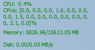

# SysPerfOverlay

SysPerfOverlay is a simple system performance monitor overlay, which displays the following informations in a small, always-on-top, overlay window:
* CPU and per-CPU usage
* Memory usage (used/total)
* Disk usage (read/write)



It supports the following features:
* Lock/unlockable dock: It can be unlocked and dragged to change its position on the screen, afterwhich it can be locked again to prevent accidental movement.
* Hidable: It can be toggled to hide/show using hotkey.
* Idle detection: It can detect inactivity of the user and suspend its update to save power.

To config SysPerfOverlay, checkout the `config.json` file that's generated after the first run.

## Dependencies
The list of dependencies are in `requirements.txt`. To install them do:
```
pip install -r requirements.txt
```

## Usage
To run SysPerfOverlay, simply do:
```
python main.py
```
### Add to Windows startup
`SysPerfOverlay_launch.bat` is a simple batch script that launches `main.py` in the background. Modify the path in the batch script accordingly.

To add SysPerfOverlay to Windows startup, simply create a shortcut of `SysPerfOverlay_launch.bat` in the Windows startup folder.
